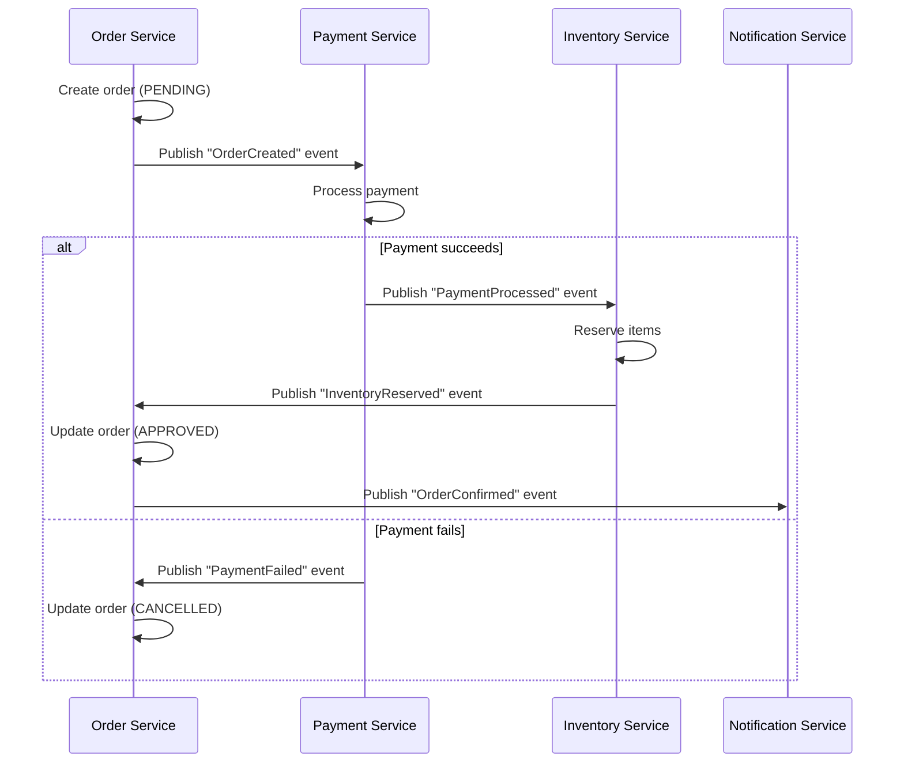
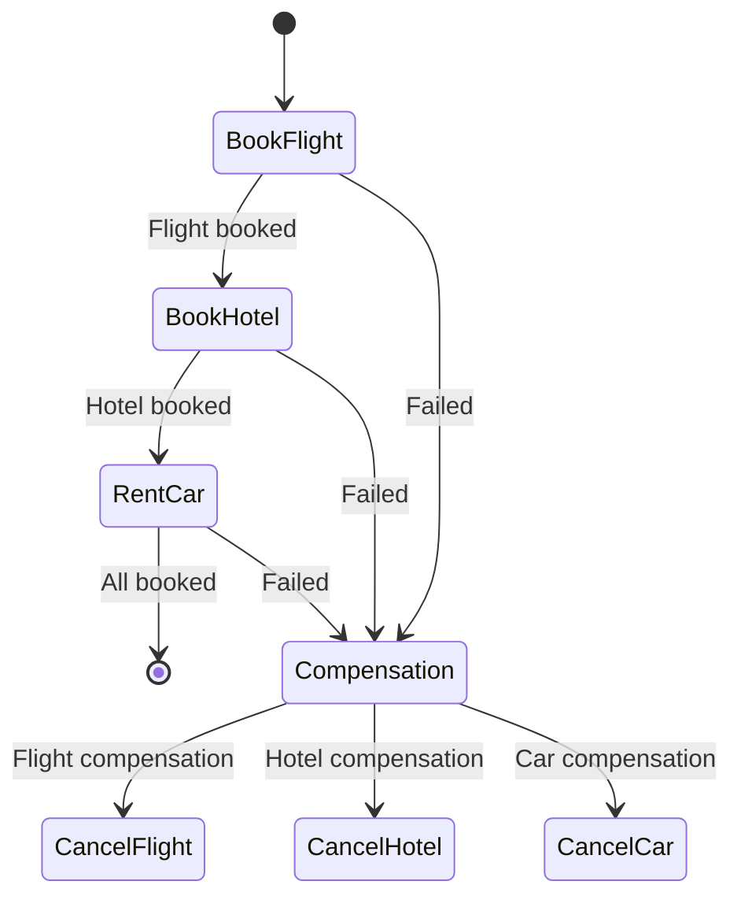

# The Saga Pattern in Microservices Architecture

The Saga pattern is a critical design pattern for managing distributed transactions across multiple microservices while maintaining data consistency without tight coupling.

## What Problem Does It Solve?

In monolithic applications, you could use ACID transactions (BEGIN TRANSACTION...COMMIT) to ensure consistency. In microservices:
- Each service has its own database
- You can't use distributed transactions (2PC) at scale
- Failures between services must be handled gracefully

## How Sagas Work

A saga is a sequence of local transactions where:
1. Each transaction updates data within a single service
2. If a transaction fails, compensating transactions undo previous changes

### Two Implementation Approaches:

**1. Choreography-Based Saga** (Event-driven)
- Services publish events that trigger next steps
- No central coordinator
- Example: Order processing flow

**2. Orchestration-Based Saga** (Central coordinator)
- A central controller manages the workflow
- Tells services what to do
- Example: Travel booking system

## Detailed Example: E-Commerce Order Saga

Let's implement an order processing flow using both approaches.

### 1. Choreography-Based Example



**Pros**: Decoupled, simple services
**Cons**: Hard to debug, complex flows become messy

### 2. Orchestration-Based Example

```java
public class OrderSaga {
    public void execute(Order order) {
        try {
            // Step 1: Process payment
            paymentService.process(order);
            
            // Step 2: Reserve inventory
            inventoryService.reserve(order);
            
            // Step 3: Approve order
            orderService.approve(order);
            
            // Step 4: Notify customer
            notificationService.sendConfirmation(order);
            
        } catch (Exception e) {
            // Compensation flow
            if (order.isPaymentProcessed()) {
                paymentService.refund(order);
            }
            if (order.isInventoryReserved()) {
                inventoryService.release(order);
            }
            orderService.cancel(order);
        }
    }
}
```

**Pros**: Centralized control, easier to manage complex flows
**Cons**: Single point of failure, more coupling

## Key Components

1. **Saga Log**: Persistent record of saga execution
   ```json
   {
     "sagaId": "123e4567",
     "status": "EXECUTING",
     "steps": [
       { "name": "process-payment", "status": "COMPLETED" },
       { "name": "reserve-inventory", "status": "FAILED" }
     ]
   }
   ```

2. **Compensating Transactions**:
   ```python
   def compensate(saga):
       for step in reversed(saga.completed_steps):
           if step.name == "process-payment":
               refund_payment(saga.order)
           elif step.name == "reserve-inventory":
               release_inventory(saga.order)
   ```

3. **Idempotent Operations**:
   ```java
   @Idempotent
   public void reserveInventory(Order order) {
       if (alreadyReserved(order.id())) {
           return; // Skip if already done
       }
       // Reserve logic
   }
   ```

## When to Use Sagas

- **Good for**:
  - Business processes spanning multiple services
  - Operations requiring eventual consistency
  - Scenarios where 2PC isn't feasible

- **Not ideal for**:
  - Very short-lived transactions
  - Systems requiring strong consistency
  - Simple CRUD operations

## Best Practices

1. **Design compensation carefully**: Undo operations must account for business rules
2. **Implement idempotency**: Retries shouldn't cause duplicate effects
3. **Monitor sagas**: Track long-running processes
4. **Use timeouts**: Prevent stuck sagas
5. **Consider human intervention**: Some failures may require manual resolution

## Real-World Example: Travel Booking Saga



This ensures that if car rental fails after flight and hotel are booked:
1. Cancel the car reservation (if any partial success)
2. Cancel the hotel booking
3. Cancel the flight reservation
4. Refund any payments made

The Saga pattern enables complex business workflows while maintaining reliability in distributed systems.